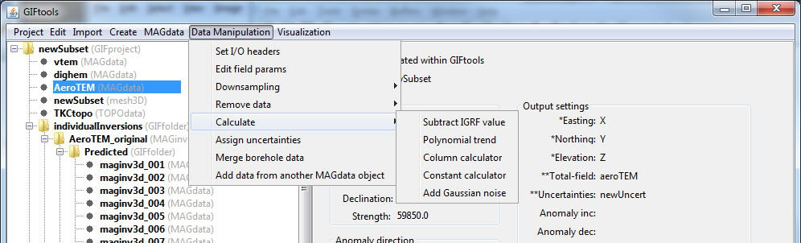

.. _combineData:

.. include:: <isonum.txt>

Combine like data objects
=========================

Any data object can be combined with another data object from its same class (e.g., MAGdata with MAGdata). Click on the data item of interest and, With the exception of DC/IP data (see NOTE below), use the menu:

**Data manipulation** |rarr| **Merge [data class] objects**

**NOTE: DC/IP data:** For DC or IP data, this function is found using the menu structure:

**Data manipulation** |rarr| **Add data** |rarr| **Merge [data class] objects**

.. figure:: ../../../images/dcipAddMenu.png
    :align: center
    :width: 400

