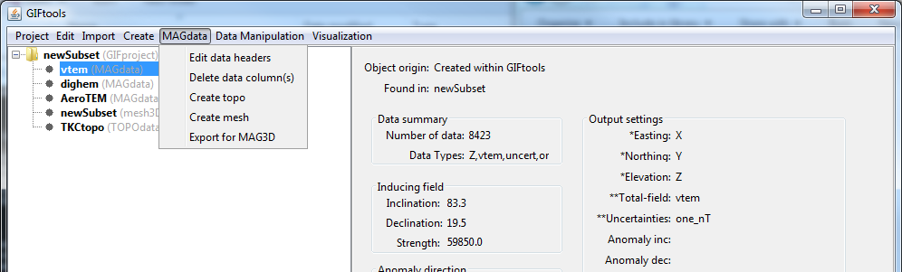

.. _dataCreateMesh:

.. include:: <isonum.txt>

Create a 3D mesh from data
==========================

To create a 3D (tensor) mesh from a given data set, click on desired data object, the menu with its class name (e.g., **FEMdata** for Frequency-domain EM data) |rarr| **Create mesh**

**NOTE:** For EM data, GIFtools will prompt the use for a background resitivity in order to perform "back-of-the-envelope" calculations for skin depth to determine a suggested core region.

