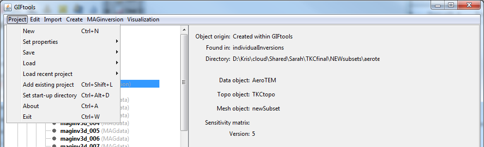

.. _projsetStartDir:

.. include:: <isonum.txt>

Set the start-up directory for GIFtools
=======================================

By default, GIFtools starts with the working directory where the executable is located. Users may change this directory by using the menu below. GIFtools will then begin in the start-up directory when the executable starts.

**Project** |rarr| **Set start-up directory**

**NOTE:** The shortcut for the functionality is ``control + alt + d``.

