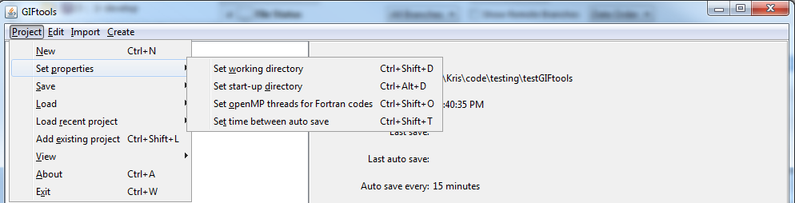

.. _projSetWorkDir:

.. include:: <isonum.txt>

Set the project's working directory
===================================

The project's working directory tells GIFtools where to output files general files and where to begin choosing files in the directory. Other working directories (e.g., folders, inversions, etc.) are saved as a relative path the project directory so that everything can be reproduced on multiple computers. To change the project's working directory use the menu:

**Project** |rarr| **Set properties** |rarr| **Set working directory**

**NOTE:** The shortcut for the functionality is ``control + shift + d``.

