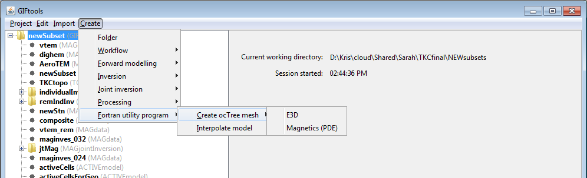

.. _createMagoctreeMesh:

.. include:: <isonum.txt>

Create an ocTree mesh for magnetics
===================================

Interaction with the Fortran utility program ``create_octree_mesh_mag`` can be done by creating an *MAGcreateOctreeMesh* item. This item will interact with the utility program to create an ocTree mesh from a magnetics data item for the inversion program ``octmagde``. To create, use the menu structure:

**Create** |rarr| **Fortran utility program** |rarr| **Create ocTree mesh** |rarr| **Magnetics (PDE)**

