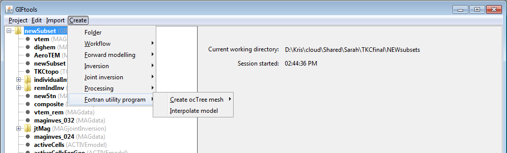

.. _interpolateOctreeToOctree:

.. include:: <isonum.txt>

Interpolate an octree model to a 3D mesh
========================================

Interaction with the Fortran utility program ``octreeTo3D`` can be done by creating an *octreeToMesh3DModel* item. This item will interact with the utility program to interpolate a model with an octree mesh to a 3D mesh. To create, use the menu structure:

**Create** |rarr| **Fortran utility program** |rarr| **Interpolate models** |rarr| **Octree to mesh3D**

