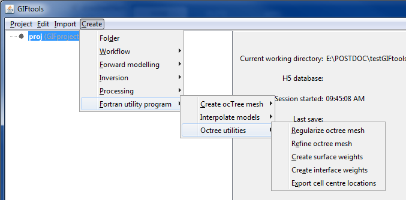

.. _refineOctreeMesh:

.. include:: <isonum.txt>

Refine an octree mesh
=====================

Interaction with the Fortran utility program ``refine_octree`` can be done by creating an *refineOctree* item. This item will interact with the utility program to make an octree mesh finer based on the values of the input model. To create, use the menu structure:

**Create** |rarr| **Fortran utility program** |rarr| **Octree utilities** |rarr| **Refine octree mesh**

