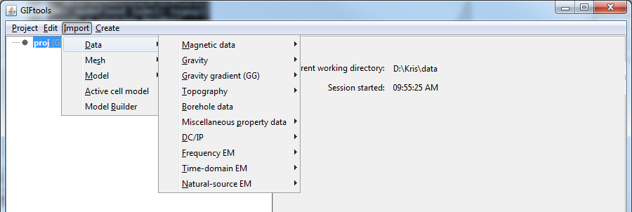

.. _importBoreholeData:

.. include:: <isonum.txt>

Import borehole data
====================

Importing borehole data requires two or three files (survey optional and assumes vertical boreholes if not given) that will be asked for in a separate dialog. To get to the import dialog, use the main project menu: **Import** |rarr| **Borehole Data**

This brings up the following import dialog:

.. figure:: ../../../images/importBHdata/import.png
	:align: center
	:figwidth: 75%

From the browse buttons in Step 1, select the :ref:`collar file <bhCollarfile>`, :ref:`survey file <bhSurveyfile>` (optional; if not provided, GIFtools assumes the borehole extend vertically downwards), and the :ref:`property file <bhPropfile>`. Once all the files are selected in Step 1, click on the "Load" button in Step 2.

For the example files we are using, our import dialog now looks like the following:

.. figure:: ../../../images/importBHdata/import2.png
	:align: center
	:figwidth: 75%

Our example has three properties: ID, LENGTH, and unitless. These are the headers provided in the :ref:`property file <bhPropfile>`. We select all three properties in this case. Once the desired properties are selected, we can move onto Step 3.

Step provides two options on how the borehole data are discretized: either the files contain data points at discrete xyz locations or the files provide a "to" and "from" value for each measurement or observation. Below, we will show how to import each type of borehole data.

.. note:: The datasets used for "discrete" and "interpolate" are different so the property headers will differ as well.

**Discrete**

For discrete data, select the "Discrete" radio button. The import dialog will look like:

.. figure:: ../../../images/importBHdata/import3.png
	:align: center
	:figwidth: 75%

Click OK to import the borehole data. You will notice that a grayed-out BOREdata item has been added to the GIFtools project tree. And the following dialog appears:

.. figure:: ../../../images/importBHdata/headers.png
	:align: center
	:figwidth: 75%

For the collar, survey, and property files, select the appropriate headers from the drop-down menus for each item. The options will match the headers given in the respective files. Once done, the dialog looks like the following:

.. figure:: ../../../images/importBHdata/headers2.png
	:align: center
	:figwidth: 75%

Again, because the borehole data in this case are data points are discrete locations, we use the "Depth" radio button instead of "Intervals". Once all the headers are assigned, click OK. The data are now being imported into GIFtools. Once done, the BOREdata item in the project tree will have a name. The name will be the same as the property file name (in our case, "geology").

The info panel will show the origin of the property data, a data summary, the set i/o headers, and the borehole IDs that were imported:

.. figure:: ../../../images/importBHdata/tree.png
	:align: center
	:figwidth: 75%

Now the borehole data can be visualized, discretized onto a mesh, and used within Model Builder to create models and weighting functions.

.. example:: Collar, survey, and property file along with a GIFtools project to repeat the above steps to import discrete borehole data: `download <http://www.eoas.ubc.ca/~sdevries/GIFtoolsExamples/ImportDiscreteBoreholeData_Example.zip>`__

**Interpolate**

File formats
------------

See below links for specifics on the files associated with borehole data:

    - :ref:`Collar file <bhCollarfile>`
    - :ref:`Survey file <bhSurveyfile>`
    - :ref:`Property file <bhPropfile>`      

