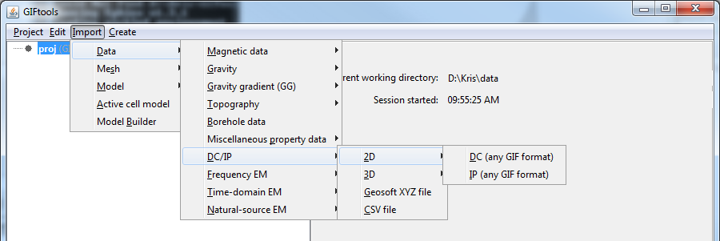

.. _importDCIP2Ddata:

.. include:: <isonum.txt>

Importing DC/IP 2D data
=======================

Use the main project menu: **Import** |rarr| **DC/IP** |rarr| **2D**

**Note**: Importing from a CSV/XYZ file is found under **Import** |rarr| **DC/IP** and is independent of dimension in the menu
 
File formats
------------

DC/IP 2D data can be imported via:

    - :ref:`2D GIF file <dcip2dObsfile>`
    - :ref:`XYZ file <XYZfile>`
    - :ref:`CSV file <CSVfile>`

