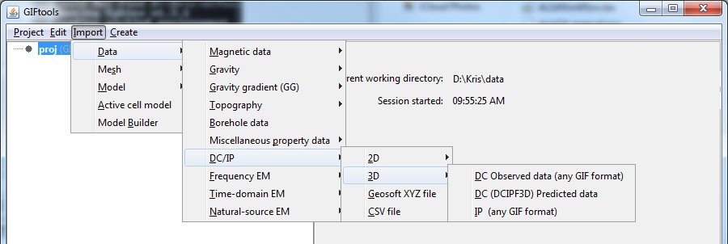

.. _importDCIP3Ddata:

.. include:: <isonum.txt>

Import DC/IP 3D data
====================

Use the main project menu: **Import** |rarr| **DC/IP** |rarr| **3D**

**Note**: Importation from a CSV/XYZ file is found under **Import** |rarr| **DC/IP** and is independent of dimension in the menu

File formats
------------

DC/IP 3D data can be imported via:

    - :ref:`3D GIF <dcip3dfile>`
    - :ref:`DCIPF3D <dcip3dfile>`      
    - :ref:`XYZ file <XYZfile>`
    - :ref:`CSV file <CSVfile>`

