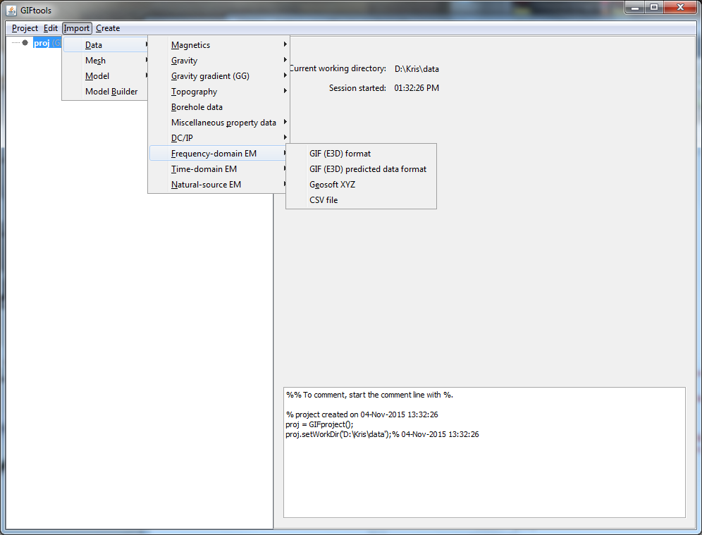

.. _femData:

.. include:: <isonum.txt>

Import FEM data
===============

To import Frequency-domain ElectroMagnetic (FEM) data, use the main project menu: **Import** |rarr| **Data** |rarr| **Frequency-domain EM**

File formats
------------

FEM data can be imported in from three main file types:

    - :ref:`GIF format <femfile>`
    - :ref:`XYZ format <XYZfile>`
    - :ref:`CSV format <CSVfile>`

**NOTE**: XYZ and CSV file formats do not include transmitters, which will need to be imported separately.

