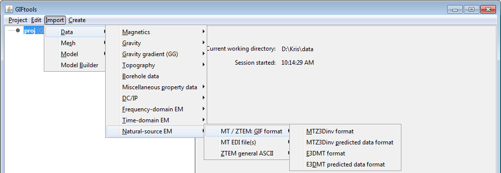
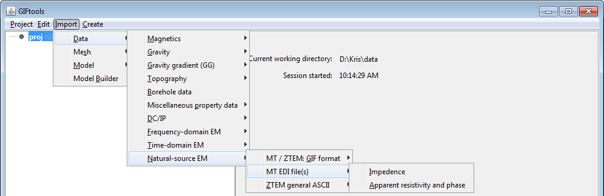

.. _importNSEMData:

.. include:: <isonum.txt>

Import natural-source EM data
=============================

There are a few file options to import magnetotelluric (MT: impedance or apparent resistivity and phase) or Z-axis Tipper EM (ZTEM) data:

MT or ZTEM data: GIF format
^^^^^^^^^^^^^^^^^^^^^^^^^^^

To load MT data that are in a GIF-formatted structure, the menu structure is:

- MTZ3D format: **Import** |rarr| **Data** |rarr| **Natural-source EM** |rarr| **MT / ZTEM: GIF format** |rarr| **MTZ3Dinv format**
- E3DMT format: **Import** |rarr| **Data** |rarr| **Natural-source EM** |rarr| **MT / ZTEM: GIF format** |rarr| **E3DMT format**

*NOTE:* This is the same structure to import predicted data, which will require an existing data item because of the output from the inversion programs.

MT data: EDI format
^^^^^^^^^^^^^^^^^^^

To load MT data that are in an EDI file or files (GIFtools will prompt and allow for multiple files), the menu structure is:

- Impedances: **Import** |rarr| **Data** |rarr| **Natural-source EM** |rarr| **MT EDI file(s)** |rarr| **Impedance**
- Apparent resitivity and phase: **Import** |rarr| **Data** |rarr| **Natural-source EM** |rarr| **MT EDI file(s)** |rarr| **Apparent resitivity and phase:**

**NOTE:** EDI is defined by The Society of Exploration Geophysicists MT / EMAP Data Interchange Standard. GIFtools will convert the (LONG, LAT) to WGS84 UTM when importing. It is assumed that the EDI file units are in mV/km/nT and will be converted to V/A as required in GIF inversion programs.

ZTEM data: ASCII format
^^^^^^^^^^^^^^^^^^^^^^^
To load ZTEM data that are in a CSV or XYZ ASCII format, the menu structure is:

- XYZ format: **Import** |rarr| **Data** |rarr| **Natural-source EM** |rarr| **ZTEM general ASCII** |rarr| **Geosoft XYZ**
- CSV format: **Import** |rarr| **Data** |rarr| **Natural-source EM** |rarr| **ZTEM general ASCII** |rarr| **CSV file**

.. figure:: ../../../images/importZTEMascii.png
    :align: center
    :width: 400

**NOTE:** XYZ and CSV file formats do not include base stations for ZTEM data, which will need to be imported or set separately.

File formats
------------

Natural source EM data can be imported from three main file types:

    - :ref:`MTZ3D GIF format <mtz3dfile>`
    - :ref:`E3DMT GIF format <e3dmtfile>`
    - EDI format
    - :ref:`XYZ format <XYZfile>`
    - :ref:`CSV format <CSVfile>`

