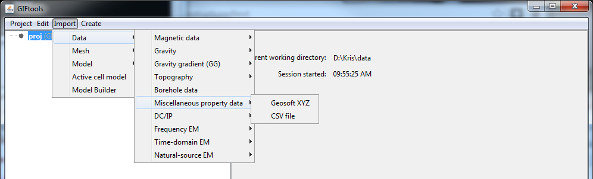

.. _importProp:

.. include:: <isonum.txt>

Importing miscellaneous property data
=====================================

This type of data covers the range of anything someone would want to bring in that has a position and value (numeric or character).

Use the main project menu: **Import** |rarr|  **Miscellaneous property data**

File formats
------------

Property data is only imported via  :ref:`XYZ <XYZfile>` or :ref:`CSV <XYZfile>` file formats.

