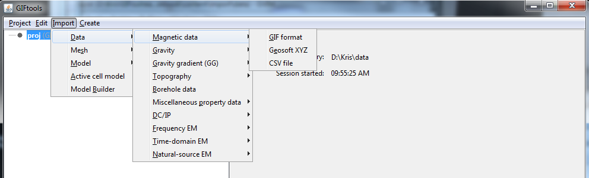

.. _magData:

.. include:: <isonum.txt>

Importing magnetic data
=======================

Use the main project menu: **Import** |rarr| **Data** |rarr| **Magnetics**

File formats
------------

Magnetic data can be loaded from three main file types:

    - :ref:`GIF format <magfile>`
    - :ref:`XYZ format <XYZfile>`
    - :ref:`CSV format <CSVfile>`

