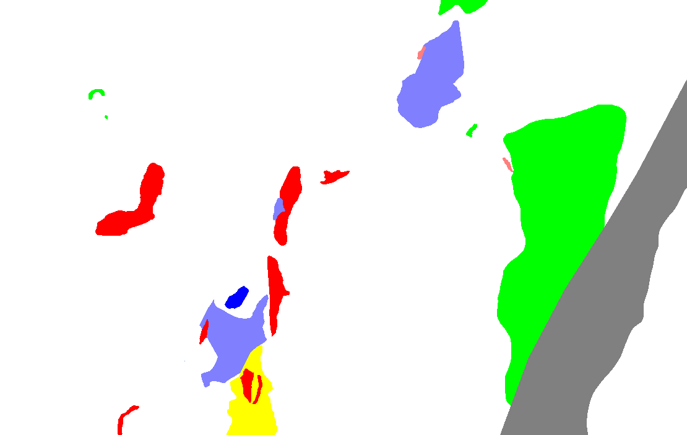

.. _imageToInversion:

.. include:: <isonum.txt>

Use a geologic image in an inversion
====================================

GIFtools can import a geologic image and convert it to a geology model. This allows one to set bounds, weights, and a physical property based on the geology ID. This is particularly useful for inversion of multiple data types in the same area. Below are the steps to use a geologic image in an inversion.

**NOTE:** In future releases of GIFtools, this functionality will be streamlined in a :ref:`inversion workflow <createInversionWorkflow>`. For now, an image and :ref:`modelBuilder module <createModelBuilder>` is required. Below are details of the step required to create reference models, bounds, etc from an image.

1. :ref:`Import a geologic image <importImage>`. The image should have solid colours indicating geologic zones (see below for example). The algorithms developed in GIFtools will struggle if annotations are included in the image.

2. If the legend file was not imported with the mesh, either :ref:`import or create <legendFile>` the image legend through the image menu. This file gives the ID and its corresponding colour code (RGB).

3. :ref:`Create <createModelBuilder>` or open modelBuilder module (click on modelBuilder item and use the menu **Model Builder** |rarr| **Show Builder**).

4. Within the modelbuilder module use the menu below. Create model (geology or physical property) using the dialog.

   **Create** |rarr| **Model** |rarr| **From map image**

.. figure:: ../../images/createImageModel.png
    :align: center
    :width: 400

Here is the image now discretized on a mesh

.. figure:: ../../images/imageModelEx.png
    :align: center
    :width: 400

5. The following steps are required (in order) due to the fact that the geology model must have a definition.
   
   - Set the geology definition: Create it using the **Geology definition** |rarr| **Edit** option within the geology model menu or :ref:`import the definition <geoDeffile>`. 

   - Set the definition's i/o headers to correspond on what is desired to be built (weights, bounds, etc.). Use the menu from the geology model:

         **Geology definition** |rarr| **Set i/o headers** 

   - Use the modelBuilder module **Build** menu and build the models desired for the inversion (e.g., **Build** |rarr| **Reference model**). Add the geology model from the image to the list of models to use for creation.

6. Once the models are built, they can be used in the inversion by selecting the inversion item and :ref:`editing its options <invEditOptions>`. Select the models made from the build within modelBuilder with the option on how it should be used (i.e., reference model, initial model, bounds, weights).

